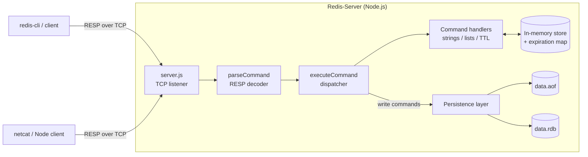

# Redis-Server

> A Redis-compatible in-memory data store built **from scratch in Node.js**, with zero runtime dependencies. It speaks the real **RESP** wire protocol over raw TCP, supports key expiry and list operations, and persists data through both **Append-Only File (AOF)** logging and **JSON snapshots**.


---

## Table of Contents

- [Overview](#overview)
- [Why I Built This](#why-i-built-this)
- [Features](#features)
- [Quick Start](#quick-start)
- [Usage](#usage)
- [Supported Commands](#supported-commands)
- [Configuration](#configuration)
- [Architecture](#architecture)
- [How It Works](#how-it-works)
- [Persistence Deep Dive](#persistence-deep-dive)
- [Project Structure](#project-structure)
- [Testing](#testing)
- [Design Decisions and Trade-offs](#design-decisions-and-trade-offs)
- [Future Improvements](#future-improvements)
- [What I Learned](#what-i-learned)
- [License](#license)
- [Author](#author)

---

## Overview

**Redis-Server** is a from-scratch implementation of a core subset of [Redis](https://redis.io), written in plain JavaScript on top of Node's built-in `net` module. There are no frameworks and no third-party runtime packages: the TCP server, the RESP protocol parser, the command engine, the expiration logic, and both persistence strategies are all implemented in this repo.

Because it speaks genuine RESP, it can be exercised with standard tooling such as `redis-cli` or `netcat`, not just a custom client.

```text
$ redis-cli -p 6379
127.0.0.1:6379> SET user:1 "meekal"
OK
127.0.0.1:6379> EXPIRE user:1 60
(integer) 1
127.0.0.1:6379> TTL user:1
(integer) 59
127.0.0.1:6379> RPUSH queue job1 job2 job3
(integer) 3
127.0.0.1:6379> LRANGE queue 0 -1
1) "job1"
2) "job2"
3) "job3"
```

## Why I Built This

I wanted to understand what actually happens *underneath* tools I use every day. Redis is a great target: small enough to build solo, but it touches real systems-engineering problems.

- **Networking:** handling raw TCP connections and a binary-safe, text-framed protocol.
- **Data structures and memory:** modelling typed values (strings, lists) in an in-memory store.
- **Time-based logic:** implementing key expiry (TTL) correctly.
- **Durability:** making in-memory data survive restarts, and understanding the trade-offs between persistence strategies.
- **Testing:** writing integration tests that drive a live server over a socket.

Reading the Redis docs only gets you so far. Building it forces you to make, and defend, the same design decisions the real thing had to make.

## Features

- **Real RESP protocol** over TCP, compatible with `redis-cli` and standard Redis clients for the supported commands.
- **Strings:** `SET`, `GET`, `DEL`, `INCR`, `DECR`.
- **Lists:** `LPUSH`, `RPUSH`, `LPOP`, `RPOP`, `LRANGE`.
- **Key expiration:** `EXPIRE` and `TTL`, with **lazy expiration** (expired keys are evicted on access).
- **Type safety:** list operations on string keys (and vice versa) are handled instead of silently corrupting data.
- **Two persistence modes**, switchable via config:
  - **AOF (append-only file):** every write command is logged and replayed on startup.
  - **Snapshotting:** the full dataset is periodically saved as JSON and reloaded on boot.
  - **Pure in-memory** mode when both are disabled.
- **Configurable AOF whitelist:** choose exactly which commands are logged.
- **Structured, namespaced logging** with ISO timestamps and a `DEBUG` env filter.
- **Integration test suite** using Node's built-in test runner (`node:test`).
- **Zero runtime dependencies.**

## Quick Start

### Prerequisites

- [Node.js](https://nodejs.org) **18 or newer** (uses `node:test` and `--watch`)
- Optional: [`redis-cli`](https://redis.io/docs/latest/develop/tools/cli/) for interactive use

### Install and run

```bash
# 1. Clone the repository
git clone https://github.com/Meekal-Jiwani/Redis-Server.git
cd Redis-Server

# 2. Install dev tooling (there are no runtime dependencies)
npm install

# 3. Start the server (auto-restarts on file changes)
npm start
```

You should see:

```text
2026-10-09T12:00:00.000Z log [core]: Persistence mode: 'appendonly'
2026-10-09T12:00:00.000Z log [server]: Server is running on 127.0.0.1:6379
```

The server listens on **`127.0.0.1:6379`**, the default Redis port. If you have a real Redis running locally, stop it first or the ports will clash.

## Usage

### With `redis-cli`

```bash
redis-cli -p 6379

SET greeting "hello world"
GET greeting
INCR visits
EXPIRE greeting 30
TTL greeting
```

### With `netcat` (raw RESP)

Since the server speaks the actual wire protocol, you can talk to it by hand:

```bash
printf '*3\r\n$3\r\nSET\r\n$3\r\nfoo\r\n$3\r\nbar\r\n' | nc 127.0.0.1 6379
# +OK

printf '*2\r\n$3\r\nGET\r\n$3\r\nfoo\r\n' | nc 127.0.0.1 6379
# $3
# bar
```

### From Node.js

```js
const net = require("net");

const client = net.createConnection({ port: 6379 }, () => {
  // RESP array: SET foo bar
  client.write("*3\r\n$3\r\nSET\r\n$3\r\nfoo\r\n$3\r\nbar\r\n");
});

client.on("data", (data) => {
  console.log(data.toString()); // +OK
  client.end();
});
```

The repo also ships a tiny helper, `buildRedisCommand("set foo bar")` in `src/utils`, that encodes a plain command string into a RESP array.

### Common use cases

| Use case | Commands |
| --- | --- |
| Cache with automatic expiry | `SET`, `EXPIRE`, `TTL`, `GET` |
| Counters (page views, rate limiting) | `INCR`, `DECR` |
| Simple job queue | `RPUSH` to enqueue, `LPOP` to dequeue |
| Stack / recent-items list | `LPUSH`, `LPOP`, `LRANGE` |

## Supported Commands

| Command | Syntax | Description | Reply |
| --- | --- | --- | --- |
| `SET` | `SET key value` | Store a string value | `+OK` |
| `GET` | `GET key` | Fetch a string value (evicts if expired) | bulk string, or `$-1` if missing |
| `DEL` | `DEL key` | Delete a key and its expiry | `:1` deleted, `:0` not found |
| `EXPIRE` | `EXPIRE key seconds` | Set a time-to-live on a key | `:1` set, `:0` key missing |
| `TTL` | `TTL key` | Remaining seconds to live | seconds, `-1` no expiry, `-2` missing/expired |
| `INCR` | `INCR key` | Increment an integer string (starts at 0) | new value |
| `DECR` | `DECR key` | Decrement an integer string (starts at 0) | new value |
| `LPUSH` | `LPUSH key v [v ...]` | Push values to the head of a list | list length |
| `RPUSH` | `RPUSH key v [v ...]` | Push values to the tail of a list | list length |
| `LPOP` | `LPOP key` | Remove and return the head | bulk string, or `$-1` |
| `RPOP` | `RPOP key` | Remove and return the tail | bulk string, or `$-1` |
| `LRANGE` | `LRANGE key start stop` | Return a range of list elements | RESP array |
| `COMMAND` | `COMMAND` | Handshake stub so `redis-cli` connects cleanly | `+OK` |

Malformed calls return Redis-style errors, for example `-ERR wrong number of arguments for 'SET' command`, `-ERR value is not an integer or out of range`, and `-ERR unknown command`.

## Configuration

All behaviour is controlled by [`src/config.json`](src/config.json):

```json
{
  "snapshot": false,
  "snapshotInterval": 5000,
  "appendonly": true,
  "aofCommands": ["SET", "DEL", "EXPIRE", "INCR", "DECR", "LPUSH", "RPUSH", "LPOP", "RPOP"]
}
```

| Option | Type | Default | Description |
| --- | --- | --- | --- |
| `snapshot` | boolean | `false` | Enable periodic JSON snapshots (`src/data.rdb`) |
| `snapshotInterval` | number (ms) | `5000` | How often the snapshot is written |
| `appendonly` | boolean | `true` | Enable the append-only log (`src/data.aof`) |
| `aofCommands` | string[] | all write commands | Which commands get logged to the AOF |

**Choosing a mode**

| `snapshot` | `appendonly` | Behaviour |
| --- | --- | --- |
| `false` | `true` | **AOF mode (default):** write commands are logged and replayed on startup |
| `true` | `false` | **Snapshot mode:** full dataset saved every `snapshotInterval` ms and loaded on startup |
| `false` | `false` | **In-memory only:** fastest, nothing survives a restart |

> Enable one persistence strategy at a time. Snapshot mode takes priority on startup.

**Logging:** set the `DEBUG` environment variable to a comma-separated list of namespaces (`server`, `core`, `persistence`) to filter log output. The default is `*` (everything).

```bash
DEBUG=server,persistence npm start
```

## Architecture



| Module | Responsibility |
| --- | --- |
| `src/server.js` | Opens the TCP server, accepts connections, wires socket data to the command engine |
| `src/core.js` | RESP parsing, command dispatch table, expiry checks, persistence initialisation |
| `src/persistence.js` | Owns the data store and expiry map; implements snapshots and AOF write/replay |
| `src/utils/logger.js` | Namespaced, timestamped logger with `DEBUG` filtering |
| `src/utils/index.js` | `buildRedisCommand` helper that encodes commands as RESP |
| `tests/server.test.js` | End-to-end tests against a live server |

## How It Works

### 1. The RESP protocol

Redis clients send commands as **RESP arrays of bulk strings**. For example, `SET foo bar` arrives on the wire as:

```text
*3\r\n        ← array of 3 elements
$3\r\nSET\r\n ← bulk string, length 3
$3\r\nfoo\r\n
$3\r\nbar\r\n
```

The server parses this into `{ command: "SET", args: ["foo", "bar"] }` and replies using RESP types:

| Prefix | Type | Example |
| --- | --- | --- |
| `+` | Simple string | `+OK\r\n` |
| `-` | Error | `-ERR unknown command\r\n` |
| `:` | Integer | `:1\r\n` |
| `$` | Bulk string | `$3\r\nbar\r\n` (`$-1` means null) |
| `*` | Array | `*2\r\n$1\r\na\r\n$1\r\nb\r\n` |

### 2. Command dispatch

Commands live in a single handler table (`commandHandlers`) keyed by command name. `executeCommand` looks up the handler, runs it against the store, and, if the command is a configured write command, logs it to the AOF. Adding a new command means adding one entry to that table.

### 3. Typed values

Every key stores a tagged value, `{ type: "string" | "list", value }`. Handlers check the type before acting, so `GET` on a list returns null instead of garbage, and `LPUSH` on a string returns an error.

### 4. Lazy key expiration

`EXPIRE` records an absolute deadline (`Date.now() + seconds * 1000`) in a separate expiry map. Expiry is **lazy**: a key is checked and evicted when it is next read. This is the same core idea Redis uses, and it avoids a background timer scanning the whole keyspace.

## Persistence Deep Dive

### Append-Only File (AOF)

Each successful write command is appended to `src/data.aof` asynchronously (non-blocking), so the event loop is never stalled by disk I/O:

```text
SET user:1 meekal
INCR visits
RPUSH queue job1
```

On startup, the log is read and every command is **replayed** through the same `executeCommand` path (with a replay flag so it is not re-logged), rebuilding the exact in-memory state.

### Snapshots (RDB-style)

With `snapshot: true`, the entire store and expiry map are serialised to `src/data.rdb` as JSON every `snapshotInterval` ms, asynchronously, and loaded synchronously at startup before the server accepts traffic.

### Trade-offs

| | AOF | Snapshot |
| --- | --- | --- |
| Durability | Higher: every write is logged | Lower: can lose up to one interval |
| Startup speed | Slower: replays history | Faster: loads one file |
| File growth | Grows with every write | Bounded by dataset size |

## Project Structure

```text
Redis-Server/
├── src/
│   ├── server.js        # TCP server entry point
│   ├── core.js          # RESP parser, command handlers, dispatcher
│   ├── persistence.js   # Store + AOF / snapshot persistence
│   ├── config.json      # Persistence and AOF settings
│   └── utils/
│       ├── index.js     # RESP command builder
│       └── logger.js    # Namespaced logger
├── tests/
│   └── server.test.js   # Integration tests (node:test)
├── package.json
├── LICENSE
└── README.md
```

## Testing

The tests are **integration tests**: they open a real TCP connection to a running server, send RESP-encoded commands, and assert on the exact bytes returned.

```bash
# Terminal 1: start the server
npm start

# Terminal 2: run the tests
npm test
```

Coverage includes:

- `SET` / `GET` round trips and missing-key behaviour (`$-1`)
- `DEL` return values
- `EXPIRE` and `TTL` (including `-1` and `-2` cases)
- `INCR` / `DECR`, including non-integer error cases
- `LPUSH`, `RPUSH`, `LPOP`, `RPOP`, `LRANGE`, including error paths
- Graceful handling of unknown commands

> Tip: set `"appendonly": false` while testing so test data doesn't accumulate in the AOF file.

## Design Decisions and Trade-offs

- **Zero runtime dependencies.** Using only Node's `net`, `fs`, and `path` modules keeps the focus on the fundamentals and keeps the install surface minimal.
- **Single-threaded, event-driven.** Like Redis itself, command execution is serialised on one thread, so there are no locks and no race conditions on the store.
- **Async writes, sync startup.** Disk writes (AOF and snapshots) are asynchronous so they don't block clients, while loading at startup is synchronous so the server never serves a half-restored dataset.
- **Replay through the real code path.** AOF recovery re-executes commands via `executeCommand` rather than a separate loader, so there is one source of truth for behaviour.
- **Config-driven persistence.** Switching durability strategy is a config change, not a code change.

## Future Improvements

Ideas for where this project could go next, grouped by theme.

**More data types and commands**
- [ ] Core utilities: `PING`, `EXISTS`, `KEYS`, `TYPE`, `RENAME`
- [ ] `SET` options (`EX`, `PX`, `NX`, `XX`) plus `PERSIST` and `PEXPIRE`
- [ ] Hashes (`HSET`, `HGET`, `HGETALL`, `HDEL`)
- [ ] Sets (`SADD`, `SREM`, `SMEMBERS`, `SINTER`)
- [ ] Sorted sets (`ZADD`, `ZRANGE`, `ZRANK`)
- [ ] Atomic multi-key operations: `MGET`, `MSET`, `INCRBY`, `DECRBY`

**Server capabilities**
- [ ] Pub/Sub (`PUBLISH`, `SUBSCRIBE`)
- [ ] Transactions (`MULTI`, `EXEC`, `DISCARD`)
- [ ] Active key expiration with a background sweeper
- [ ] Memory limits with eviction policies (LRU / LFU)
- [ ] Multiple logical databases (`SELECT`)
- [ ] Blocking list operations (`BLPOP`, `BRPOP`)

**Reliability and security**
- [ ] `AUTH` password support
- [ ] TLS encryption
- [ ] Hybrid persistence (snapshot + AOF together, as in real Redis)
- [ ] Graceful shutdown that flushes pending writes

**Scale and operations**
- [ ] Master-replica replication
- [ ] Cluster-style sharding across nodes
- [ ] `INFO` command with server and memory stats
- [ ] Environment-variable and CLI-flag configuration

**Developer experience**
- [ ] Docker image and `docker-compose` setup
- [ ] CI pipeline (GitHub Actions) running tests on every push
- [ ] Test coverage reporting and unit tests alongside the integration suite
- [ ] Benchmarks against real Redis using `redis-benchmark`
- [ ] Publishing as an installable npm package / CLI

## What I Learned

- How a text-framed protocol like **RESP** is parsed, and how much correctness hides in details such as length prefixes and `\r\n` framing.
- How Node's `net` module and event loop model concurrent clients on a single thread.
- The real trade-offs between **AOF and snapshot** persistence, and why Redis offers both.
- Why **lazy expiration** is a pragmatic design for TTLs.
- How to write integration tests that exercise a network service end to end.

## License

Distributed under the **MIT License**. See [`LICENSE`](LICENSE) for details.

## Author

**Meekal Jiwani**
Computer Science student at Simon Fraser University
GitHub: [@Meekal-Jiwani](https://github.com/Meekal-Jiwani)

---

*If you found this project interesting, feel free to star the repo or open an issue with feedback.*
